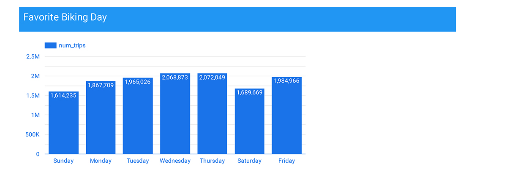

# Citbike Rental Overview Report
Dataset taken from Google's public bigQuery. 

## Overview
Citi Bike is NYC’s official bike share program, designed to give residents and visitors a fun, affordable and convenient alternative to walking, taxis, buses and subways. 
We're analyzing the data to look for : 
1. Total trip
2. Average trip duration
3. Average bike trip per day
4. Average bike numbers used daily
5. Top start station
6. Top bikes used
7. Daily trend
8. Trip duration from user's gender
9. Most used bikes

## Result
Tools : SQL query using google BigQuery, Data visualizaton using Looker Studio (GDS). 

- a

- b

- c

- d

- e

- f

